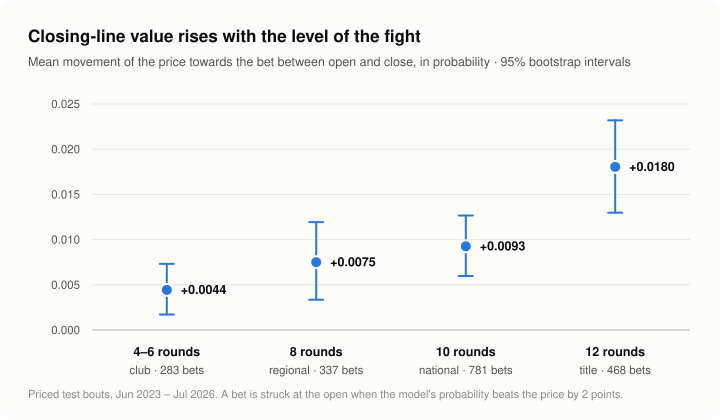

# Vertex Boxing — a fundamentals model against the boxing closing line

Roman Prigodskii · final report, September 2026 · all numbers from
[`scripts/simulation/results/`](../scripts/simulation/results/), produced by one
command ([`reproduce.sh`](../scripts/simulation/reproduce.sh))

## The answer first

The project was built to test one claim: the UFC closing line is sharp, but
boxing's regional and club lines are soft, so that is where a model that reads
records and ratings would find room. It tested the claim on every bout the
available odds cover, and the claim points the wrong way.

- **On its own the model does not beat the closing line.** On 3,288 priced
  bouts it scores 0.3680 nats against the market's 0.3469, a gap of
  **−0.0211 [−0.0322, −0.0100]**; retrained once a year, as a deployment would be,
  −0.0198 [−0.0311, −0.0086].
- **Blended into the price, it improves the price** by **+0.0043 [+0.0024, +0.0062]** at a
  weight of λ = 0.17 on the model. The market price does not contain
  everything the model knows.
- **The edge is at the top of the sport, not the bottom.** Closing-line value
  rises with the scheduled distance, from +0.0044 on four-to-six-rounders to
  +0.0180 on twelve-rounders, and three independent markers of level agree. On
  a window the rule was never chosen on, the top of the market gave 2.0 times
  the closing-line value of the bottom.
- **It does not make money.** On the tier where the value is largest, the margin
  paid at the open is larger than the movement the model catches, under either
  way of taking the margin out. Priced at the close, the strategy returns −6.1%
  under the de-vig that calibrates the closing price, and −0.6% under the other.
  No real bet was placed; everything here is a backtest.
- **A pre-registered random search over 200 configurations found nothing** that
  holds on bouts it had not seen. The final configuration was already the top
  of that space (section 8).
- **The project caught a post-bell leak in its own data.** Put back, it is worth
  +0.0038 [+0.0031, +0.0044] on held-out bouts and nothing on priced ones. It
  was removed, and the bench was made to reproduce itself: re-run seven weeks
  later, the published scoreboard came back identical to 16 significant
  digits. That section is below, and it is the most reusable thing here.

## 1. Data

**Bouts.** 413,279 professional bouts from 1950 to July 2026 and 154,510
fighters, assembled from BoxRec fighter and event pages, Wikipedia record tables
and Wikidata. Each bout carries the date, both fighters, the result and method,
the scheduled and completed rounds, the division and each fighter's record at
the time; where BoxRec publishes them, the weigh-in, the referee, the three
judges and their scorecards. The corpus is frozen as the snapshot `l6`, and
every number in this report is measured on it.

**Prices.** Opening and closing moneylines for 23,666 matchups from
ProBoxingOdds, 2016 onwards, with the best price across its ten books. The
closing price used for scoring is the *worst* on the board, the conservative
reading for the model. Polymarket trades, recovered from its on-chain history,
supply a price with no margin in it for a separate check (section 5).

**What is not here.** Neither the corpus nor the prices are in this repository.
BoxRec's terms forbid redistribution of data derived from it and the prices are
a third party's, so what is published is the code, the aggregate results, and
the protocol. The data-collection code is not published either.

## 2. Model

A LightGBM binary classifier: did corner A win. Draws are left out of training
and scoring, because a two-way moneyline prices "A or B"; adding them to the
target was measured and moved nothing.

- **Point in time.** Every feature is computed by a chronological replay of the
  whole corpus, updating each fighter after the bout, so a feature for a fight
  sees only what existed before its first bell. Ties on the date are broken by
  a stable key, and every set the replay sums over is sorted, so the replay
  produces the same matrix in any process.
- **231 features** in groups: ratings (Elo at three speeds, Glicko-2,
  Bradley-Terry), strength of schedule, record and finishing rates, activity and
  layoffs, level of the bout (distance, belts, card), the officials assigned to
  the card, and a **comparability block**: whether two ratings come from the
  same connected part of the win graph, their path length and shared opponents,
  a point-in-time PageRank, division-relative ratings, and per-fighter rates
  shrunk towards the population.
- **Symmetric by construction.** Trained on both orientations of every bout, and
  at prediction time the two answers are averaged, so the model does not care
  which name was typed first. A permanent test checks that every column flips
  sign, swaps with its twin, turns into 1 − p, or stays put when the corners are
  exchanged.
- **The market is never an input.** Prices are used to score, never to train.
- Six-year half-life on training weights, extremely randomised trees (the one
  regulariser that paid), three seeds averaged in logit space.

## 3. How it is scored

The test window starts at 10 June 2023: the 60th percentile of the priced bouts'
dates, so that 40% of the priced bouts are held out. Everything is trained on
bouts before it.

Three instruments, because each answers a different question:

| instrument | bouts | question |
|---|---|---|
| corpus holdout | 89,087 | does a change help at all — has the power to see 0.001 |
| premium holdout | 12,536 | does it help on the kind of bout a market prices (≥ 8 scheduled rounds, both men ≥ 8 bouts) |
| priced bouts | 3,288 | does it beat the price |

- The corpus holdout is split by date into a *select* half and a *confirm* half.
  Choices are made on the first and reported on the second.
- Differences between two models are paired bootstraps on the same bouts, and a
  one-seed screen is not trusted below 0.0015. Section 6 explains why.
- **The margin is taken out** by the method whose de-vigged price is best
  calibrated on the training slice. That is power, with a calibration slope of
  1.02. Proportional flatters the model and is not used for the
  headline.
- **The blend weight λ** is fitted on priced bouts that an *auxiliary* model,
  trained to three years before the cutoff, has not seen. Fitted against the
  main model, λ comes out near 0.85 because the model remembers its own training
  bouts.

## 4. Results

### 4.1 The scoreboard

| | log-loss |
|---|---|
| corpus holdout (89,087 bouts) | 0.3342 |
| premium holdout (12,536) | 0.2820 |
| priced bouts — model | 0.3680 |
| priced bouts — closing price | 0.3469 |
| **model − market** | **−0.0211 [−0.0322, −0.0100]** |
| **blend − market**, λ = 0.17 | **+0.0043 [+0.0024, +0.0062]** |
| model − market, retrained yearly | −0.0198 [−0.0311, −0.0086] |

The same model read against the three prices on the board:

| reading of the board | margin | market | model − market | blend − market | λ |
|---|---|---|---|---|---|
| the close, worst price of the ten books | 7.3% | 0.3469 | −0.0211 [−0.0322, −0.0100] | +0.0043 [+0.0024, +0.0062] | 0.17 |
| the close, best price on the board | 3.0% | 0.3478 | −0.0202 [−0.0313, −0.0091] | +0.0047 [+0.0027, +0.0067] | 0.18 |
| the open | 5.6% | 0.3591 | −0.0089 [−0.0206, +0.0026] | +0.0107 [+0.0063, +0.0150] | 0.37 |

The model's predictions are identical in all three rows; only the market's price
changes (`scoreboard_close.json`, `scoreboard_best.json`, `scoreboard_open.json`).

Against the opening price the model is within noise of the market, and the
blend takes more than a third of its weight from the model. Between open and
close the price learns something the model does not know. The best price on the
board is the worst forecast of the three: it is the upper envelope of ten books,
not anyone's opinion.

### 4.2 The thesis, cut by level

Bets are struck at the open when the model's probability exceeds the price's by
2 points. The threshold was fixed before the table was seen. Closing-line value
(CLV) is the movement of the de-vigged price towards the bet between open and
close, in probability. It is reported because it converges far faster than
return does.

| scheduled distance | priced bouts | bets | CLV [95%] | realised return |
|---|---|---|---|---|
| 4–6 rounds (club) | 597 | 283 | +0.0044 [+0.0017, +0.0073] | −14.9% |
| 8 rounds (regional) | 582 | 337 | +0.0075 [+0.0033, +0.0119] | +5.4% |
| 10 rounds (national, continental) | 1,195 | 781 | +0.0093 [+0.0060, +0.0127] | +4.1% |
| 12 rounds (title) | 629 | 468 | +0.0180 [+0.0130, +0.0232] | +13.1% |

<picture>
  <source media="(prefers-color-scheme: dark)" srcset="figures/clv_by_distance-dark.svg">
  
</picture>

If the thesis were right, value would grow as the level drops. It shrinks.
The belt on the line gives the same ordering, from +0.0067 on beltless bouts on
big cards to +0.0152 on continental and world titles. So does the depth of the
thinner fighter's record, up to a point: +0.0082 under 8 bouts, +0.0117 from 8
to 25. Past 25 bouts it falls back to +0.0059, but that slice is 141 bets and
its interval covers zero (`level_cut.json`). The mechanism is the useful part.
The model reads records and ratings, and a rating is only as good as the record
under it. At world level both men have thirty bouts behind them. On a club card
the market knows which of the two is being managed, and the model is reading
two thin records.

**Where the model adds anything at all.** Fitting λ separately inside slices
known before the bell (`lambda_by_slice.json`):

| slice, known before the bell | bouts fitted / tested | λ |
|---|---|---|
| 6 rounds or fewer, or distance unknown | 556 / 882 | **0.00** |
| 8 rounds | 444 / 582 | **0.32** |
| 10 rounds | 945 / 1,195 | **0.20** |
| 12 rounds | 526 / 629 | **0.19** |
| thinner record under 3 bouts | 174 / 209 | **0.00** |
| thinner record 3–8 bouts | 444 / 657 | **0.06** |
| thinner record 8–15 bouts | 837 / 1,244 | **0.21** |
| thinner record 15+ bouts | 1,017 / 1,178 | **0.25** |
| no belt | 1,467 / 1,946 | **0.13** |
| regional or national belt | 311 / 378 | **0.39** |
| continental or world belt | 694 / 964 | **0.09** |
| same country | 841 / 1,164 | **0.01** |
| different countries | 1,629 / 2,124 | **0.24** |

Over all priced bouts λ = 0.15 in this diagnostic run (one seed, no mirror
training), against 0.17 for the full model in 4.1.

λ = 0 means the price already contains everything the model knows about that
population, so no feature, however good, can pay there through the blend.

**On an era the rule never saw.** The model was refitted to 10 June 2021 and
the rule copied, unedited, onto 10 June 2021 → 10 June 2023
(`rule_oos.json`):

| slice, 10 June 2021 → 10 June 2023 | bets | CLV [95%] | realised return [95%] | at the close, power | at the close, proportional |
|---|---|---|---|---|---|
| all priced bouts | 1,145 | +0.0220 [+0.0179, +0.0264] | +4.0% [−3.5%, +12.0%] | −6.3% [−8.0%, −4.6%] | +1.0% [−0.4%, +2.5%] |
| lower tier: ≤ 8 rounds, no belt | 365 | +0.0136 [+0.0080, +0.0191] | −8.3% [−20.6%, +4.7%] | −11.8% [−14.6%, −9.0%] | −0.6% [−2.6%, +1.7%] |
| upper tier: 12 rounds, or a continental or world belt | 461 | +0.0276 [+0.0200, +0.0347] | +9.5% [−2.6%, +22.8%] | −3.2% [−5.9%, −0.4%] | +2.8% [+0.3%, +5.4%] |

The direction held, and more clearly than when this test was first run on the
model that still carried the leak (×1.8 then): the upper tier's closing-line
value is 2.0 times the lower tier's, and the two intervals no longer overlap.
The money did not follow. The upper tier's realised return, +9.5%, has zero
inside its interval. Priced at the close, it depends on how the margin is taken
out: −3.2% under power, +2.8% [+0.3%, +5.4%] under proportional. Section 4.3
says which of the two readings to believe, and why the answer is not settled.

### 4.3 From closing-line value to money

CLV and return are the same bets in two units, and between them sits the
margin. A bet is struck at a price that carries it, and the line has to move
further than the margin before the bet is worth anything. On the upper tier
(twelve rounds, or a continental or world belt: 803 bets,
`clv_money.json`):

| per bet, in probability | proportional | power |
|---|---|---|
| the book keeps at the open | +0.0313 | +0.0275 |
| the close moved towards us (CLV) | +0.0143 [+0.0104, +0.0182] | +0.0180 [+0.0134, +0.0225] |
| net | −0.0169 | −0.0095 |
| return if the closing price is the truth | −0.6% [−1.9%, +0.9%] | −6.1% [−7.7%, −4.4%] |
| return realised | +8.7% [−0.0%, +18.0%] | same bets |

The margin exceeds the movement under both methods. The realised return is
positive, but its interval is 18 points wide. The closing-implied return has
no fight outcomes in it and is several times narrower, and it is negative.

**Which reading to believe.** Power is the method whose de-vigged closing price
is calibrated on the training slice: slope 1.02, against 1.30 for proportional,
which leaves favourites under-priced. Under power, the upper tier loses at the
close on both windows: −6.1% here and −3.2% on the earlier window in 4.2. Under
proportional it is −0.6% here and +2.8% [+0.3%, +5.4%] there. The two readings
disagree about how the book spreads its margin across favourites and longshots,
and that is exactly what a price-based strategy lives or dies on. A closing
price cannot tell them apart. So the calibrated reading says the strategy loses
money, the other says it roughly breaks even, and neither says the edge is
large. Only prices taken live, before the bell, can settle it.

**A correction made for this report.** Until September the script behind this
table took the margin out of the open proportionally and out of the close by
the power method. The two methods disagree about favourites and longshots
before the line has moved at all, and that disagreement alone produced the
published pattern "the value is all on favourites; on longshots the line runs
away from us". With one method at both ends, CLV is positive in every price
band under both. Which band pays at the closing price depends on the method,
so no price-ceiling rule is claimed.

## 5. Checks that the comparison is fair

- **Not the margin.** The model loses even to a price with no margin in it. On
  the twelve bouts that also traded on Polymarket, the bookmaker's power-de-
  vigged close scored 0.3274, Polymarket 0.3643, and the model 0.4436
  (`diagnostics/polymarket.txt`). Twelve bouts decide nothing about the model;
  what they do show is that the de-vigged bookmaker price and a price with no
  margin at all agree to a median of 0.047.
- **Not a late open.** Polymarket's first fills sit closer to the bookmaker's
  close than to its open (0.049 against 0.058), so the recorded open is a
  genuinely early price.
- **Not one site's coverage.** The ProBoxingOdds re-crawl fixes a parser that
  paired the wrong rows, and it prices 3,644 test bouts rather than 3,288.
  On it the gap is −0.0206 [−0.0315, −0.0101] and the blend +0.0037
  [+0.0022, +0.0052] (`robustness_pbo_v3.json`). A merge that also takes
  OddsPortal's prices reads −0.002 instead, and that is a data fault, not a
  finding (`diagnostics/merged_feed.json`). Where the merge took OddsPortal's
  price, the favourite sits on the wrong corner on 37% of the changed bouts.
  On the bouts only OddsPortal prices, the "market" scores 1.02 nats, worse than a
  coin flip. The merge is not used for any number here.
- **Not calibration.** The model's calibration slope is 1.004 on the corpus
  holdout, 1.009 on the premium holdout and 0.924 on priced bouts, and the best
  single factor on its logits, chosen on the test set itself, recovers 0.0010 of
  the 0.0211 gap (`calibration.json`). The gap is information, not confidence:
  77% of it sits on bouts where the market is bolder than the model
  (`diagnostics/where.txt`).

## 6. The leak, and what else the bench got wrong

**Judges' scorecards are published only for fights that go the distance.** The
corpus kept a bout's judges only where the scorecards were saved, so the mere
presence of the judge fields told the model how the fight had ended, a fact
nobody has before the bell.

| | P(fight ended early) |
|---|---|
| judges recorded | 0.097 |
| judges not recorded | 0.743 |

A crawl gap was the obvious objection, and a control ruled it out. On 5,673
events from 2024 on, one page and one crawl each, the judges are recorded for
88.6% of decisions and 7.3% of stoppages. Ablating the obvious feature had not
removed the leak either. The five judge columns share one NaN pattern, and
gradient boosting reads the bit from the pattern.

Put back into the final model, the leak is worth +0.0038 [+0.0031, +0.0044] on
the confirmation half, +0.0013 [+0.0003, +0.0024] on the premium holdout and
−0.0007 [−0.0030, +0.0015] on priced bouts (`deploy_and_leak.json`). It paid where the model knows least: in the version it
was found in, 65% of its value came from bouts where the thinner man had under
three recorded bouts, and 0.3% from twelve-rounders. So it inflated the corpus
score and barely touched the market comparison. The legitimate replacement is
the officials assigned to the *card*, which is decided before the first bell.
`leak_check.py` now tests every column for exactly this: whether its presence or
its value separates stoppages from decisions.

**Other defects found, all fixed:**

- **Reproducibility across runs.** LightGBM chooses row-wise or column-wise
  histogram building by *timing* its first iterations, so two identical runs on
  a busy machine scored 0.3406 and 0.3408. It is now pinned.
- **Reproducibility across processes.** Five columns were summed over a Python
  set, whose order changes with per-process hash randomisation. A difference of
  1e-16 put values on the other side of a split and cost 0.0003. Both fixes have
  permanent tests.
- **Hyperparameters that never arrived.** Parameters were passed to training but
  not to LightGBM's dataset construction, so `min_data_in_leaf` was 20 at binning
  time while the model believed it was 100.
- **The yardstick.**
  - The power de-vig silently returned raw, margin-loaded probabilities whenever
    a board summed to under 1.
  - "Shin" is algebraically identical to the additive method on a two-way book,
    verified to 1e-13 on 22,052 books, so four de-vig methods were three.
  - An early blend beat the close only under the kindest way of taking the
    margin out, and lost under the others.
- **The bench can lie by a seed.** The paired bootstrap resamples bouts under two
  fixed models. It answers "is this difference real on this population", not
  "will it survive retraining". One seed gave +0.0006 [+0.0001, +0.0011] for a
  change that three seeds put at +0.0001 [−0.0002, +0.0004].

## 7. What did not work

Each was built, measured on the protocol above, and rejected. The full list with
numbers is in [`model.md`](model.md) and [`status.md`](status.md).

- Amateur pedigree: 6,090 Olympic and major-games appearances, a strong signal
  on its own, −0.0014 to the model.
- Six ways of reweighting training towards the priced or competitive
  population.
- A training target graded by how decisively a bout was won.
- Stacking auxiliary predictions of stoppage and dominance.
- Isotonic, Platt and regime-dependent calibration.
- Hyperparameter search, twice: a 500-trial TPE search in August, and the
  pre-registered random search of section 8. Neither found anything that held
  on unseen bouts.
- Whole-history rating (BoxRec's own method), built from scratch. Better than Elo
  on its own; +0.0000 on top of the rest.
- A form strip parsed from event pages.
- Early stopping on the premium slice.
- Retuning Elo's K to its standalone optimum.

## 8. A large random search, under a protocol written first

The last thing tried was brute force, set up so that it could not fool us.
[`search_protocol.md`](search_protocol.md) was written and committed before the
first fit, and its SHA-256 is stamped into every result. 200 random
configurations were drawn over leaves, learning rate, leaf size, feature and
bagging fractions, L2, extremely randomised trees, bins, path smoothing, the
half-life of the training weights, and up-weighting the priced population. Each
was trained on bouts up to 10 June 2021 and ranked on 2021–2023.

The final configuration, screened the same way under five seeds, scored
0.3174–0.3181 on that window's premium bouts. That spread is the noise a
one-seed screen cannot see through. The median random configuration scored
0.3201, and six beat the best seed. The top five were then refitted in the full
deployment stack and scored once on the 2023–2026 holdout, which the search
never saw (`search.json`, `search_screen.jsonl`):

| candidate | lead where it was chosen | on unseen priced-type bouts [99%] | on the unseen corpus | model − closing price |
|---|---|---|---|---|
| `c0063` | +0.0017 | −0.0004 [−0.0012, +0.0004] | −0.0004 | −0.0214 |
| `c0098` | +0.0008 | −0.0014 [−0.0031, +0.0002] | −0.0018 | −0.0231 |
| `c0031` | +0.0008 | −0.0005 [−0.0015, +0.0006] | −0.0002 | −0.0229 |
| `c0034` | +0.0006 | −0.0014 [−0.0026, −0.0001] | −0.0017 | −0.0216 |
| `c0159` | +0.0005 | −0.0038 [−0.0058, −0.0019] | −0.0018 | −0.0273 |
| final model | — | — | — | −0.0211 |

**None survives the pre-registered rule.** Every one of the five is worse than
the final configuration on bouts it had not seen, and two of them are
significantly worse even at 99%. The best of them led by +0.0017 where it was
chosen and trailed by 0.0004 where it was not, so the whole of its lead was
selection. The final configuration was already at the top of this space. More
candidates would have produced a larger lead on the selection window and the
same answer on the confirmation, which is why a larger search was not run.

## 9. What is open

- **The unpriced tail cannot be tested.** A club four-rounder that gets a line at
  all is usually a televised prospect's showcase. The anonymous regional card
  gets none, so there is no price to be soft. The thesis was refuted where it can
  be tested, and it is untestable where it was aimed.
- **Coverage.** Only 25–37% of title-level bouts carry a price in any year, so
  the betting-side intervals are wide by necessity.
- **No forward test.** Every number here is historical. The one test that would
  settle the money question is to publish predictions before the bell and grade
  them against prices that were live at the time.

## Reproducing

```bash
cd scripts/simulation
./reproduce.sh            # every result file, about 2.5 hours on an 8-core M3
./reproduce.sh level_cut  # or one step
```

Each file in `results/` is written by one script, and
[`results/NUMBERS.md`](../scripts/simulation/results/NUMBERS.md) maps every
number in this report to the file and field it comes from. The bench is
deterministic: the scoreboard published on 2026-08-04, re-run on 2026-09-21 on
the library versions in `results/environment.json`, came back identical in every
field to 16 significant digits.
